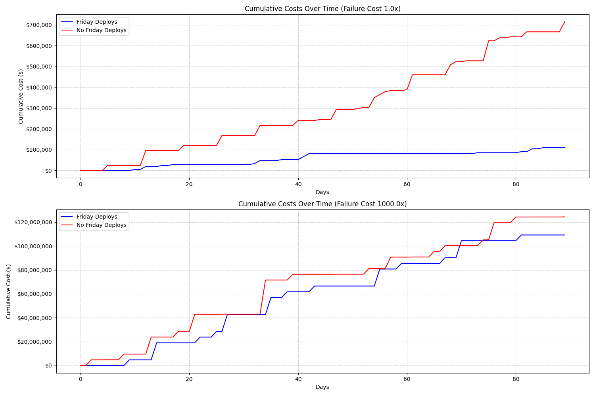

# Friday Deployment Risk Simulation

This project simulates and compares two deployment strategies:
1. Teams that deploy any day including Fridays
2. Teams that avoid deploying on Fridays

## Simulation Parameters

### Team Configuration
- Team size: 5 people
- Average hourly rate: $75/hour

### Task Generation
- 3 new tasks per day
- Task complexity ranges from 1-5 story points
- 30% probability of dependencies on other teams

### Risk Parameters
- Base deployment failure rate: 5%
- Weekend recovery takes 3x longer
- Normal recovery time: 2 hours

### Business Parameters
- Operational revenue: $1,000 per hour
- System downtime cost: $2,000 per hour

## Results

The simulation was run with two different failure cost multipliers to understand how increasing the cost of failures affects the optimal deployment strategy.

### Baseline Scenario (1.0x Cost Multiplier)
```
Friday Deployments Allowed:
Total Cost: $109,250.00
Failed Deploys: 13
Successful Deploys: 239
Delayed Tasks: 0
Total Recovery Hours: 46.0

No Friday Deployments:
Total Cost: $714,250.00
Failed Deploys: 11
Successful Deploys: 244
Delayed Tasks: 26
Total Recovery Hours: 38.0
```

### High Risk Scenario (1000.0x Cost Multiplier)
```
Friday Deployments Allowed:
Total Cost: $109,250,000.00
Failed Deploys: 13
Successful Deploys: 246
Delayed Tasks: 0
Total Recovery Hours: 46.0

No Friday Deployments:
Total Cost: $124,436,000.00
Failed Deploys: 16
Successful Deploys: 236
Delayed Tasks: 39
Total Recovery Hours: 52.0
```

## Visualization



The graphs show cumulative costs over time for both strategies under different risk scenarios. Lower costs indicate better performance.
